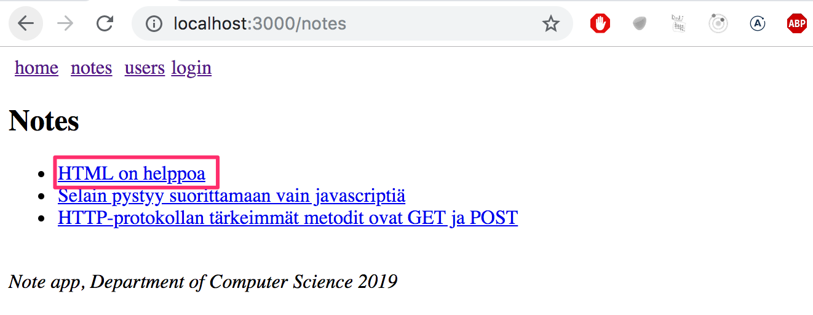
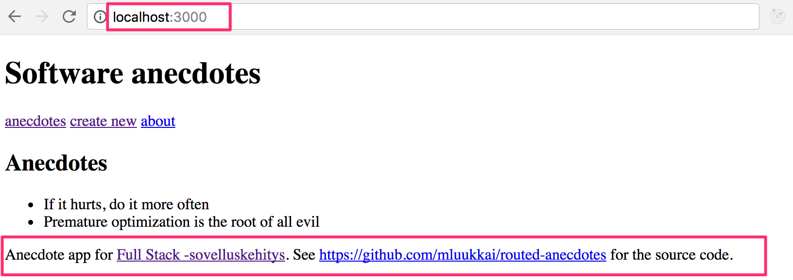

<div class="content">

Kurssin seitsemännen osan tehtävät poikkeavat jossain määrin. Tässä luvussa on normaaliin tapaan [kolme luvun teoriaan liittyvää tehtävää](/osa7/react_router#tehtavia).

Tämän luvun tehtävien lisäksi seitsemäs osa sisältää kertaavan ja hieman tämän osan teoriaakin soveltavan [tehtäväsarjan](/osa7/tehtavia_blogilistan_laajennus), jossa laajennetaan osissa 4 ja 5 tehtyä Bloglist-sovellusta.

### Sovelluksen navigaatiorakenne

Palataan osan 6 jälkeen jälleen Reduxittoman Reactin pariin.

On erittäin tyypillistä, että web-sovelluksissa on navigaatiopalkki, jonka avulla on mahdollista vaihtaa sovelluksen näkymää. Muistiinpanosovelluksemme voisi sisältää pääsivun:


ja omat sivunsa muistiinpanojen ja käyttäjien tietojen näyttämiseen:


[Vanhan koulukunnan websovelluksessa](/osa0#perinteinen-web-sovellus) sovelluksen näyttämän sivun vaihto tapahtui siten että selain teki palvelimelle uuden HTTP GET -pyynnön ja renderöi sitten palvelimen palauttaman näkymää vastaavan HTML-koodin.

Single page appeissa taas ollaan todellisuudessa koko ajan samalla sivulla, ja selaimessa suoritettava Javascript-koodi luo illuusion eri "sivuista". Jos näkymää vaihdettaessa tehdään HTTP-kutsuja, niiden avulla haetaan ainoastaan JSON-muotoista dataa, jota uuden näkymän näyttäminen ehkä edellyttää.

Navigaatiopalkki ja useita näkymiä sisältävä sovellus on erittäin helppo toteuttaa Reactilla.

Seuraavassa on eräs tapa:

```js
import React, { useState } from 'react'
import ReactDOM from 'react-dom'

const Home = () => (
  <div> <h2>TKTL notes app</h2> </div>
)

const Notes = () => (
  <div> <h2>Notes</h2> </div>
)

const Users = () => (
  <div> <h2>Users</h2> </div>
)

const App = () => {
  const [page, setPage] = useState('home')

 const  toPage = (page) => (event) => {
    event.preventDefault()
    setPage(page)
  }

  const content = () => {
    if (page === 'home') {
      return <Home />
    } else if (page === 'notes') {
      return <Notes />
    } else if (page === 'users') {
      return <Users />
    }
  }

  const padding = {
    padding: 5
  }

  return (
    <div>
      <div>
        <a href="" onClick={toPage('home')} style={padding}>
          home
        </a>
        <a href="" onClick={toPage('notes')} style={padding}>
          notes
        </a>
        <a href="" onClick={toPage('users')} style={padding}>
          users
        </a>
      </div>

      {content()}
    </div>
  )
}

ReactDOM.render(<App />, document.getElementById('root'))
```

Eli jokainen näkymä on toteutettu omana komponenttinaan ja sovelluksen tilassa <i>page</i> pidetään tieto siitä, minkä näkymää vastaava komponentti menupalkin alla näytetään.

Menetelmä ei kuitenkaan ole optimaalinen. Kuten kuvista näkyy, sivuston osoite pysyy samana vaikka välillä ollaankin eri näkymässä. Jokaisella näkymällä tulisi kuitenkin olla oma osoitteensa, jotta esim. bookmarkien tekeminen olisi mahdollista. Sovelluksessamme ei myöskään selaimen <i>back</i>-painike toimi loogisesti, eli <i>back</i> ei vie edelliseksi katsottuun sovelluksen näkymään vaan jonnekin ihan muualle. Jos sovellus kasvaisi suuremmaksi ja sinne haluttaisiin esim. jokaiselle käyttäjälle sekä muistiinpanolle oma yksittäinen näkymänsä, itse koodattu <i>reititys</i> eli sivuston navigaationhallinta menisi turhan monimutkaiseksi.

Reactissa on onneksi valmis komponentti [React router](https://github.com/ReactTraining/react-router) joka tarjoaa erinomaisen ratkaisun React-sovelluksen navigaation hallintaan.

Muutetaan ylläoleva sovellus käyttämään React routeria. Asennetaan React router komennolla

```js
npm install --save react-router-dom
```

React routerin tarjoama reititys saadaan käyttöön muuttamalla sovellusta seuraavasti:

```js
import {
  BrowserRouter as Router,
  Route, Link, Redirect, withRouter
} from 'react-router-dom'

const App = () => {

  const padding = { padding: 5 }

  return (
    <div>
      <Router>
        <div>
          <div>
            <Link style={padding} to="/">home</Link>
            <Link style={padding} to="/notes">notes</Link>
            <Link style={padding} to="/users">users</Link>
          </div>
          <Route exact path="/" render={() => <Home />} />
          <Route path="/notes" render={() => <Notes />} />
          <Route path="/users" render={() => <Users />} />
        </div>
      </Router>
    </div>
  )
}
```

Reititys, eli komponenttien ehdollinen, selaimen <i>urliin perustuva</i> renderöinti otetaan käyttöön sijoittamalla komponentteja <i>Router</i>-komponentin lapsiksi, eli <i>Router</i>-tagien sisälle.

Huomaa, että vaikka komponenttiin viitataan nimellä <i>Router</i> kyseessä on [BrowserRouter](https://reacttraining.com/react-router/web/api/BrowserRouter), sillä importtaus tapahtuu siten, että importattava olio uudelleennimetään:

```js
import {
  BrowserRouter as Router,
  Route, Link, Redirect, withRouter
} from 'react-router-dom'
```

Manuaalin mukaan

> <i>BrowserRouter</i> is a <i>Router</i> that uses the HTML5 history API (pushState, replaceState and the popState event) to keep your UI in sync with the URL.

Normaalisti selain lataa uuden sivun osoiterivillä olevan urlin muuttuessa. [HTML5 history API](https://css-tricks.com/using-the-html5-history-api/):n avulla <i>BrowserRouter</i> kuitenkin mahdollistaa sen, että selaimen osoiterivillä olevaa urlia voidaan käyttää React-sovelluksen sisäiseen "reitittämiseen", eli vaikka osoiterivillä oleva url muuttuu, sivun sisältöä manipuloidaan ainoastaan Javascriptillä ja selain ei lataa uutta sisältöä palvelimelta. Selaimen toiminta back- ja forward-toimintojen ja bookmarkien tekemisen suhteen on kuitenkin loogista, eli toimii kuten perinteisillä web-sivuilla.

Routerin sisälle määritellään selaimen osoiteriviä muokkaavia <i>linkkejä</i> komponentin [Link](https://reacttraining.com/react-router/web/api/Link) avulla. Esim.

```js
<Link to="/notes">notes</Link>
```

luo sovellukseen linkin, jonka teksti on <i>notes</i> ja jonka klikkaaminen vaihtaa selaimen osoiteriville urliksi <i>/notes</i>.

Selaimen urliin perustuen renderöitävät komponentit määritellään komponentin [Route](https://reacttraining.com/react-router/web/api/Route) avulla. Esim.

```js
<Route path="/notes" render={() => <Notes />} />
```

määrittelee, että jos selaimen osoiteena on <i>/notes</i>, renderöidään komponentti <i>Notes</i>.

Sovelluksen juuren, eli osoitteen  <code>/</code> määritellään renderöivän komponentti <i>Home</i>:

```js
<Route exact path="/" render={() => <Home />} />
```

joudumme käyttämään routen <i>path</i> attribuutin edessä määrettä <i>exact</i>, muuten <i>Home</i> renderöityy kaikilla muillakin poluilla, sillä juuri <code>/</code> on kaikkien muiden polkujen <i>alkuosa</i>.

### Parametroitu route

Tarkastellaan sitten hieman modifioitua versiota edellisestä esimerkistä. Esimerkin koodi kokonaisuudessaan on [täällä](https://github.com/fullstackopen-2019/misc/blob/master/router-app.js).

Sovellus sisältää nyt viisi eri näkymää, joiden näkyvyyttä kontrolloidaan routerin avulla. Edellisestä esimerkistä tuttujen komponenttien <i>Home</i>, <i>Notes</i> ja <i>Users</i> lisäksi mukana on kirjautumisnäkymää vastaava <i>Login</i> ja yksittäisen muistiinpanon näkymää vastaava <i>Note</i>.

<i>Home</i> ja <i>Users</i> ovat kuten aiemmassa esimerkissä. <i>Notes</i> on hieman monimutkaisempi, se renderöi propseina saamansa muistiinpanojen listan siten, että jokaisen muistiinpanon nimi on klikattavissa



Nimen klikattavuus on toteutettu komponentilla <i>Link</i> ja esim. muistiinpanon, jonka id on 3 nimen klikkaaminen aiheuttaa selaimen osoitteen arvon päivittymisen muotoon <i>notes/3</i>:

```js
const Notes = (props) => (
  <div>
    <h2>Notes</h2>
    <ul>
      {props.notes.map(note =>
        <li key={note.id}>
          <Link to={`/notes/${note.id}`}>{note.content}</Link>
        </li>
      )}
    </ul>
  </div>
)
```

Kun selain siirtyy muistiinpanon yksilöivään osoitteeseen, esim. <i>notes/3</i>, renderöidään komponentti <i>Note</i>:

```js
const Note = ({ note }) => (
  <div>
    <h2>{note.content}</h2>
    <div>{note.user}</div>
    <div><strong>{note.important ? 'important' : ''}</strong></div>
  </div>
)
```

Tämä tapahtuu laajentamalla komponentissa <i>App</i> olevaa reititystä seuraavasti:

```js
<Router>
  <div>
    <div>
      <Link style={padding} to="/">home</Link>
      <Link style={padding} to="/notes">notes</Link>
      <Link style={padding} to="/users">users</Link>
    </div>

    <Route exact path="/" render={() =>
      <Home />
    } />
    // highlight-start
    <Route exact path="/notes" render={() =>
      <Notes notes={notes} />
    } />
    <Route exact path="/notes/:id" render={({ match }) =>
      <Note note={noteById(match.params.id)} />
    } />
  </div>
  // highlight-end
</Router>
```

Kaikki muistiinpanot renderöivään routeen on lisätty määre <i>exact path="/notes"</i> sillä muuten se renderöityisi myös <i>/notes/3</i>-muotoisten polkujen yhteydessä.

Yksittäisen muistiinpanon näkymän renderöivä route määritellään "expressin tyyliin" merkkaamalla reitin parametrina oleva osa merkinnällä <i>:id</i>

```js
<Route exact path="/notes/:id" />
```

Renderöityvän komponentin määrittävä <i>render</i>-attribuutti pääsee käsiksi id:hen parametrinsa [match](https://reacttraining.com/react-router/web/api/match) avulla seuraavasti:

```js
render={({ match }) =>
  <Note note={noteById(match.params.id)} />}
```

Muuttujassa <i>match.params.id</i> olevaa id:tä vastaava muistiinpano selvitetään apufunktion _noteById_ avulla

```js
const noteById = (id) =>
  notes.find(note => note.id === Number(id))
```

renderöityvä <i>Note</i>-komponentti saa siis propsina urlin yksilöivää osaa vastaavan muistiinpanon.

### withRouter ja history

Sovellukseen on myös toteutettu erittäin yksinkertainen kirjautumistoiminto. Jos sovellukseen ollaan kirjautuneena, talletetaan tieto kirjautuneesta käyttäjästä komponentin <i>App</i> tilaan <i>user</i>.

Mahdollisuus <i>Login</i>-näkymään navigointiin renderöidään menuun ehdollisesti

```js
<Router>
  <div>
    <div>
      <Link style={padding} to="/">home</Link>
      <Link style={padding} to="/notes">notes</Link>
      <Link style={padding} to="/users">users</Link>
      // highlight-start
      {user
        ? <em>{user} logged in</em>

        : <Link to="/login">login</Link>
      }
      // highlight-end
    </div>
  </div>
</Router>
```

eli jos käyttäjä on kirjautunut, renderöidäänkin linkin <i>Login</i> sijaan kirjautuneen käyttäjän käyttäjätunnus:


Kirjautumisesta huolehtivan komponentin koodi seuraavassa

```js
import {
  // ...
  withRouter // highlight-line
} from 'react-router-dom'

const LoginNoHistory = (props) => {
  const onSubmit = (event) => {
    event.preventDefault()
    props.onLogin('mluukkai')
    props.history.push('/') // highlight-line
  }

  return (
    <div>
      <h2>login</h2>
      <form onSubmit={onSubmit}>
        <div>
          username: <input />
        </div>
        <div>
          password: <input type='password' />
        </div>
        <button type="submit">login</button>
      </form>
    </div>
  )
}

const Login = withRouter(LoginNoHistory) // highlight-line
```

Lomakkeen toteutukseen liittyy muutama huomionarvoinen seikka.
Kirjautumisen yhteydessä funktiossa _onSubmit_ kutsutaan propseina vastaanotetun [history](https://reacttraining.com/react-router/web/api/history)-olion metodia _push_. Käytetty komento _props.history.push('/')_ saa aikaan sen, että selaimen osoiteriville tulee osoitteeksi <code>/</code> ja sovellus renderöi osoitetta vastaavan komponentin <i>Home</i>.

Komponentti saa käyttöönsä propsin <i>history</i> siten, että se "kääritään" funktiolla [withRouter](https://github.com/ReactTraining/react-router/blob/master/packages/react-router/docs/api/withRouter.md). Funktio _withRouter_ toimii hyvin samaan tapaan kuin Reduxin yhteydessä käytetty _connect_, se lisää parametrina saamallensa komponentille joukon propseja.

### redirect

Näkymän <i>Users</i> routeen liittyy vielä eräs mielenkiintoinen detalji:

```js
<Route path="/users" render={() =>
  user ? <Users /> : <Redirect to="/login" />
} />
```

Jos käyttäjä ei ole kirjautuneena, ei renderöidäkään näkymää <i>Users</i> vaan sen sijaan <i>uudelleenohjataan</i> käyttäjä <i>Redirect</i>-komponentin avulla kirjautumisnäkymään

```js
<Redirect to="/login" />
```

Todellisessa sovelluksessa olisi kenties parempi olla kokonaan näyttämättä navigaatiovalikossa kirjautumista edellyttäviä näkymiä jos käyttäjä ei ole kirjautunut sovellukseen.

Seuraavassa vielä komponentin <i>App</i> koodi kokonaisuudessaan:

```js
const App = () => {
  const [notes, setNotes] = useState([
    {
      id: 1,
      content: 'HTML on helppoa',
      important: true,
      user: 'Matti Luukkainen'
    },
    // ...
  ])

  const [user, setUser] = useState(null)

  const login = (user) => {
    setUser(user)
  }

  const noteById = (id) =>
    notes.find(note => note.id === Number(id))

  const padding = { padding: 5 }

  return (
    <div>
      <Router>
        <div>
          <div>
            <Link style={padding} to="/">home</Link>
            <Link style={padding} to="/notes">notes</Link>
            <Link style={padding} to="/users">users</Link>
            {user
              ? <em>{user} logged in</em>
              : <Link to="/login">login</Link>
            }
          </div>

          <Route exact path="/" render={() =>
            <Home />
          } />
          <Route exact path="/notes" render={() =>
            <Notes notes={notes} />
          } />
          <Route exact path="/notes/:id" render={({ match }) =>
            <Note note={noteById(match.params.id)} />
          } />
          <Route path="/users" render={() =>
            user ? <Users /> : <Redirect to="/login" />
          } />
          <Route path="/login" render={() =>
            <Login onLogin={login} />
          } />
        </div>
      </Router>
      <div>
        <br />
        <em>Note app, Department of Computer Science 2019</em>
      </div>
    </div>
  )
}
```

Komponentin sisällössä määritellään myös kokonaan <i>Router</i>:in ulkopuolella oleva nykyisille web-sovelluksille tyypillinen <i>footer</i>-elementti, eli sivuston pohjalla oleva osa, joka on näkyvillä riippumatta siitä mikä komponentti sovelluksen reititetyssä osassa näytetään.
</div>
<div class="tasks">

### Tehtäviä

Jatketaan anekdoottien parissa. Ota seuraaviin tehtäviin pohjaksi repositoriossa <https://github.com/fullstackopen-2019/routed-anecdotes> oleva reduxiton anekdoottisovellus.

Jos kloonaat projektin olemassaolevan git-reposition sisälle, <i>poista kloonatun sovelluksen git-konfiguraatio:</i>

```bash
cd routed-anecdotes   // eli mene ensin kloonatun repositorion hakemistoon
rm -rf .git
```

Sovellus käynnistyy normaaliin tapaan, mutta joudut ensin asentamaan sovelluksen riippuvuudet:

```bash
npm install
npm start
```

#### 7.1: routed anecdotes, step1

Lisää sovellukseen React Router siten, että <i>Menu</i>-komponentissa olevia linkkejä klikkailemalla saadaan säädeltyä näytettävää näkymää.

Sovelluksen juuressa, eli polulla _/_ näytetään anekdoottien lista:



Pohjalla oleva <i>Footer</i>-komponentti tulee näyttää aina.

Uuden anekdootin luominen tapahtuu esim. polulla <i>create</i>:


Huom: jos saat seuraavan virheilmoituksen


pääset siitä eroon sisällyttämällä kaiken Router-elementin sisälle tulevaan <i>div</i>-elementtiin:

```bash
<Router>
  <div>
    ...
  </div>
</Router>
```

#### 7.2: routed anecdotes, step2

Toteuta sovellukseen yksittäisen anekdootin tiedot näyttävä näkymä:


Yksittäisen anekdootin sivulle navigoidaan klikkaamalla anekdootin nimeä


#### 7.3: routed anecdotes, step3

Luomislomakkeen oletusarvoinen toiminnallisuus on melko hämmentävä, sillä kun lomakkeen avulla luodaan uusi muistiinpano, mitään ei näytä tapahtuvan.

Paranna toiminnallisuutta siten, että luomisen jälkeen siirrytään automaattisesti kaikkien anekdoottien näkymään <i>ja</i> käyttäjälle näytetään 10 sekunnin ajan onnistuneesta lisäyksestä kertova notifikaatio:


</div>
